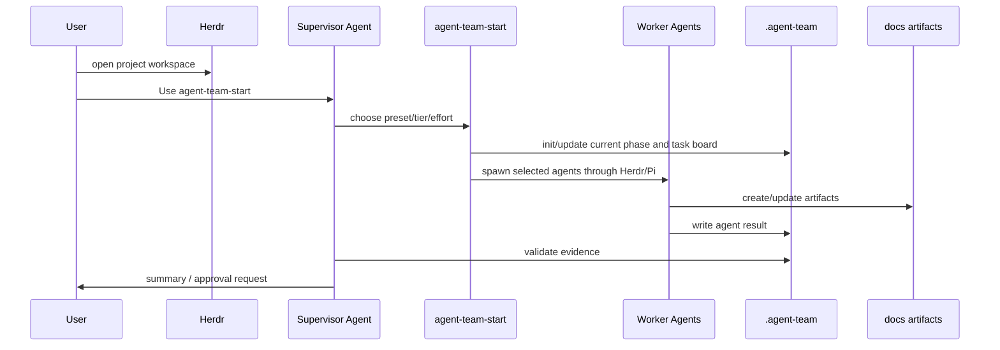
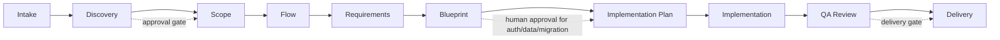
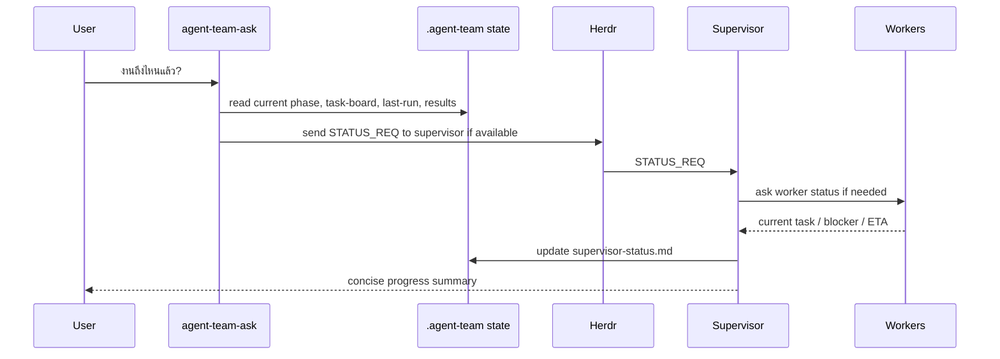

# 🤖 Business App Agent Team

Agent Team Kit สำหรับเริ่มทีม AI agents แบบมี phase, artifact, approval gate และ supervisor ที่ถามสถานะระหว่างงานได้

ใช้กับงานประเภท:

- internal tool
- business workflow
- approval system
- dashboard
- CRM / ERP-lite
- web app ที่ต้องเริ่มจาก requirement และ flow ก่อนเขียน code

## 📝 Changelog

> เวลาแก้ repo นี้ ให้เพิ่มรายการใหม่ไว้บนสุด เพื่อให้เห็นว่าเปลี่ยนอะไรล่าสุด

### 2026-06-30

- 📚 Rewrite README ใหม่เป็นคู่มือติดตั้ง/ใช้งานแบบ end-to-end
- 📈 เพิ่ม Mermaid diagrams สำหรับ architecture, startup flow, phase flow และ status flow
- 🧭 อธิบายชัดว่า Herdr เป็น control plane, Pi เป็น runtime หลัก, Codex ใช้ได้แบบ manual/fallback แต่ auto-spawn path ตอนนี้ใช้ Pi
- 🧑‍✈️ เพิ่ม `agent-team-start` skill เพื่อให้เริ่มทีมแบบ skill-first ไม่ต้องจำ shell commands
- 📊 เพิ่ม flow ถาม supervisor ระหว่างงาน เช่น "งานถึงไหนแล้ว" หรือ "ตอนนี้ทำอะไรอยู่"
- ⚙️ เพิ่ม `config/agent-team.json` สำหรับ preset, agents, model tier และ effort
- 🛠️ เพิ่ม `agent-team-start` และ `agent-team-ask` commands สำหรับให้ skill เรียกใช้อยู่เบื้องหลัง
- ✨ เพิ่ม emoji ใน README เพื่อให้อ่านง่ายและ scan เร็วขึ้น
- 🛡️ ขยาย `.gitignore` เพื่อกันไฟล์ local, secrets, cache, logs, runtime state และ agent session artifacts
- 📄 เพิ่ม MIT License
- 🚀 สร้าง public GitHub repo และ push package เวอร์ชันแรก

## ✅ สรุปสั้นที่สุด

ถ้าจะใช้งานจริงแบบหลาย agent:

1. เปิดโปรเจคใน `herdr`
2. ใช้ `pi` เป็น supervisor/worker runtime หลัก
3. เรียก skill `agent-team-start` หรือ command `agent-team-start`
4. เลือก preset เช่น `discovery`, `blueprint`, `implementation`
5. ระหว่างงานถามได้ว่า "งานถึงไหนแล้ว" ผ่าน `agent-team-ask`

Codex ใช้ได้ แต่ใน package version นี้:

- ✅ ใช้ Codex เป็น manual supervisor ได้ โดยให้ Codex อ่าน skill/prompt แล้วทำตาม workflow
- ✅ ใช้ Codex เป็น manual coding worker ได้
- ⚠️ auto-spawn ผ่าน `agent-team-start --execute` ตอนนี้ spawn ด้วย `pi` เป็นหลัก
- 🔜 ถ้าต้องการ Codex auto-spawn เป็น first-class worker ต้องเพิ่ม runtime adapter ในรอบถัดไป

## 🧠 ภาพรวม Architecture


### แต่ละตัวทำหน้าที่อะไร

| ส่วน | หน้าที่ |
|---|---|
| `Herdr` | Terminal multiplexer / control plane สำหรับเปิดหลาย pane และดูสถานะ agents |
| `Pi` | Runtime หลักที่ scripts ใช้ spawn supervisor/workers |
| `Codex` | ใช้ได้แบบ manual supervisor/worker หรือ coding agent แต่ยังไม่ใช่ auto-spawn default |
| `agent-team-start` skill | ทางเข้าหลัก ให้ user เริ่มทีมโดยไม่ต้องจำ shell |
| `.agent-team/` | state กลางของโปรเจค เช่น current phase, task board, status, results |
| `docs/` | artifacts ที่ทีม agents ต้องผลิตและใช้เป็น evidence |

## 📦 ใน repo มีอะไร

```text
business-app-agent-team/
  config/
    agent-team.json              # preset, agent, model tier, effort
  skills/
    agent-team-start/            # skill หลักสำหรับเริ่ม/ถาม status
    agent-orchestration/
    system-discovery/
    requirement-slicing/
    ux-flow-design/
    data-model-review/
    qa-risk-review/
  prompts/
    supervisor.md
    discovery-analyst.md
    product-manager.md
    ux-flow-designer.md
    solution-architect.md
    data-modeler.md
    qa-risk-reviewer.md
    implementation-worker.md
    code-reviewer.md
  scripts/
    agent-team-start.sh
    ask-supervisor.sh
    init-project.sh
    spawn-agent-team.sh
    collect-agent-status.sh
    validate-artifacts.sh
    close-phase.sh
  templates/
  schemas/
  docs/
  examples/
```

## 🧰 Prerequisites

ขั้นต่ำ:

```bash
git --version
python3 --version
bash --version
```

แนะนำสำหรับใช้งานเต็มรูปแบบ:

```bash
herdr --version
pi --version
gh --version
```

ถ้ายังไม่มี GitHub CLI:

```bash
brew install gh
gh auth login
```

ถ้ายังไม่มี Herdr หรือ Pi ให้ติดตั้งตามวิธีของทีม/เครื่องคุณก่อน เพราะ `--execute` ต้องใช้สองตัวนี้

## 🚀 ติดตั้ง Package

### 1. Clone repo

```bash
cd ~/Documents/PROJECTS
git clone https://github.com/SuphakornP/business-app-agent-team.git
cd business-app-agent-team
```

### 2. ตรวจ package

```bash
bash scripts/validate-package.sh
```

ถ้าพร้อมใช้จะเห็น:

```text
package validation passed
```

### 3. ทำให้ใช้ command สั้นได้

วิธีง่ายสุดคือใช้ path ตรง:

```bash
bash ~/Documents/PROJECTS/business-app-agent-team/scripts/agent-team-start.sh --help
```

ถ้าอยากใช้ command สั้น เช่น `agent-team-start`:

```bash
cd ~/Documents/PROJECTS/business-app-agent-team
npm link
```

หลังจากนั้นจะเรียกได้:

```bash
agent-team-start --help
agent-team-ask --help
agent-team-status .
```

ถ้าไม่อยากใช้ `npm link` ให้ใช้ `bash /path/to/script.sh` เหมือนเดิมได้

## 🏁 เริ่มใช้งานกับโปรเจคใหม่

สมมติ target project คือ:

```bash
~/Documents/PROJECTS/my-new-app
```

สร้าง project folder ถ้ายังไม่มี:

```bash
mkdir -p ~/Documents/PROJECTS/my-new-app
```

init agent team state:

```bash
bash ~/Documents/PROJECTS/business-app-agent-team/scripts/init-project.sh ~/Documents/PROJECTS/my-new-app
```

หรือถ้าใช้ `npm link` แล้ว:

```bash
agent-team-init ~/Documents/PROJECTS/my-new-app
```

ระบบจะสร้าง:

```text
my-new-app/
  .agent-team/
    current-phase.md
    task-board.md
    supervisor-status.md
    agent-results/
    tasks/
  docs/
    product/
    ux/
    architecture/
    data/
    qa/
    agent/
```

## 🪟 ต้องเปิด Herdr ยังไง

เข้า target project แล้วเปิด Herdr:

```bash
cd ~/Documents/PROJECTS/my-new-app
herdr
```

ถ้า agent ถูกเปิดอยู่ใน Herdr แล้ว สามารถเช็กได้ด้วย:

```bash
echo "$HERDR_ENV"
```

ถ้าได้ `1` แปลว่า pane นี้อยู่ใน Herdr และสามารถใช้คำสั่ง `herdr pane ...` / `herdr agent ...` ได้

จากนั้นให้มีอย่างน้อย 1 supervisor agent อยู่ใน Herdr workspace

### Runtime ที่แนะนำ: Pi Supervisor

ใน pane ของ Herdr ให้รัน:

```bash
pi \
  --model opencode-go/glm-5.1 \
  --prompt-template ~/Documents/PROJECTS/business-app-agent-team/prompts/supervisor.md \
  --name supervisor_my-new-app
```

ถ้าอยากประหยัด cost ในช่วงทดลอง ใช้ free model ได้:

```bash
pi \
  --model opencode/minimax-m3-free \
  --prompt-template ~/Documents/PROJECTS/business-app-agent-team/prompts/supervisor.md \
  --name supervisor_my-new-app
```

จากนั้นบอก supervisor:

```text
Use agent-team-start.
Start with discovery for this project.
Do not design or implement until phase gates are approved.
```

### ใช้ Codex ได้ไหม

ได้ แต่มี 2 แบบ:

| วิธี | เหมาะกับ | หมายเหตุ |
|---|---|---|
| Pi supervisor + Pi workers | งานหลาย agent ผ่าน Herdr | recommended path ของ package นี้ |
| Codex เป็น manual supervisor | คนที่เปิด Codex แล้วอยากให้คุม workflow | ให้ Codex อ่าน `skills/agent-team-start/SKILL.md` และ `prompts/supervisor.md` |
| Codex เป็น coding worker | implementation/review แบบ manual | ใช้ได้ แต่ `agent-team-start --execute` ยังไม่ auto-spawn Codex |

ถ้าจะใช้ Codex manual:

```text
Read skills/agent-team-start/SKILL.md and prompts/supervisor.md.
Act as supervisor for this project.
Use .agent-team/ and docs/ as the source of truth.
Start with discovery and do not implement yet.
```

## 🧑‍✈️ เริ่ม Agent Team แบบ Skill-first

เมื่อมี Herdr และ Pi พร้อมแล้ว วิธีที่อยากให้ใช้คือ:

```text
Use agent-team-start
เริ่ม agent team สำหรับโปรเจคนี้ ทำ discovery ก่อน ใช้ balanced model effort medium
```

เบื้องหลัง skill จะเรียก script ประมาณนี้:

```bash
agent-team-start . --preset discovery --tier balanced --effort medium --goal "Start discovery" --execute
```

ถ้ายังไม่พร้อมเปิด agent จริง ให้ preview ก่อน:

```bash
agent-team-start . --preset discovery --tier balanced --effort medium --goal "Start discovery" --dry-run
```

## 🧭 Startup Flow



## 🎛️ Preset / Model / Effort

### Preset

| Preset | ใช้เมื่อ | Agents |
|---|---|---|
| `discovery` | เริ่มจากโจทย์/idea | `discovery-analyst` |
| `planning` | ทำ scope และ requirements | `product-manager`, `qa-risk-reviewer` |
| `flow` | ทำ user journey/screen flow | `ux-flow-designer`, `qa-risk-reviewer` |
| `blueprint` | ทำ architecture/API/data model | `solution-architect`, `data-modeler`, `qa-risk-reviewer` |
| `implementation` | เขียน code หลัง blueprint ผ่านแล้ว | `implementation-worker`, `code-reviewer` |
| `review` | ตรวจ QA/review | `qa-risk-reviewer`, `code-reviewer` |

### Model Tier

| Tier | ใช้เมื่อ |
|---|---|
| `free` | งานเบา ประหยัด cost |
| `balanced` | default สำหรับงานทั่วไป |
| `strong` | architecture, implementation, review, high-risk |

### Effort

| Effort | ใช้เมื่อ |
|---|---|
| `low` | งานเล็ก ชัดเจน |
| `medium` | default |
| `high` | งานซับซ้อน ต้อง reasoning มาก |

ตัวอย่าง:

```bash
agent-team-start . --preset blueprint --tier strong --effort high --goal "Design approval workflow blueprint" --execute
```

## 🚦 Phase Flow



## 📊 ถาม Supervisor ระหว่างงาน

ระหว่าง agents ทำงานอยู่ คุณถามได้:

```text
Use agent-team-start
งานถึงไหนแล้ว ตอนนี้ agent แต่ละตัวทำอะไรอยู่ มี blocker ไหม
```

หรือเรียก command:

```bash
agent-team-ask . "งานถึงไหนแล้ว ตอนนี้ทำอะไรอยู่ มี blocker ไหม"
```

ถ้าไม่ได้ใช้ `npm link`:

```bash
bash ~/Documents/PROJECTS/business-app-agent-team/scripts/ask-supervisor.sh . "งานถึงไหนแล้ว"
```

## 📈 Status Flow



คำตอบที่ดีควรมี:

- current phase
- active agents
- แต่ละ agent ทำอะไรอยู่
- artifact ที่เสร็จแล้ว
- blocker/open question
- next step
- ETA/confidence ถ้ารู้

## 🧪 ตัวอย่างการใช้งานจริง

### Case: เริ่มระบบ Approval Workflow

1. เปิด Herdr:

```bash
cd ~/Documents/PROJECTS/approval-workflow
herdr
```

2. เปิด Pi supervisor ใน Herdr pane:

```bash
pi \
  --model opencode-go/glm-5.1 \
  --prompt-template ~/Documents/PROJECTS/business-app-agent-team/prompts/supervisor.md \
  --name supervisor_approval
```

3. สั่งเริ่ม discovery:

```text
Use agent-team-start
เริ่ม discovery สำหรับระบบ approval request ของทีม operation ใช้ balanced effort medium
```

4. ถ้าต้องการ command ตรง:

```bash
agent-team-start . --preset discovery --tier balanced --effort medium --goal "Discover approval request workflow for operations team" --execute
```

5. ถามสถานะ:

```text
Use agent-team-start
งานถึงไหนแล้ว มี blocker อะไรไหม
```

6. ตรวจ artifact:

```bash
agent-team-status .
agent-team-validate . discovery
```

7. ถ้าผ่านแล้วปิด phase:

```bash
agent-team-close-phase . discovery
```

## 📋 Agent Result Contract

ทุก worker ต้องจบงานด้วย format นี้:

```markdown
STATUS: done | blocked | needs_approval | failed
CONFIDENCE: 0-100
TASK_RECEIVED:
WHAT_I_DID:
ARTIFACTS_CREATED_OR_UPDATED:
KEY_DECISIONS:
ASSUMPTIONS:
RISKS:
TESTS_OR_CHECKS:
OPEN_QUESTIONS:
NEXT_RECOMMENDED_ACTION:
```

ถ้า agent บอก `done` แต่ไม่มี artifact/check/risk/decision/open question ที่เคลียร์แล้ว supervisor ต้องถือว่ายังไม่เสร็จ

## ✅ Approval Gate

ต้องขอ human approval ก่อน:

- database migration
- auth/permission logic
- paid API / external service / credentials
- production deployment config
- sensitive personal, financial, legal, health data
- destructive file/data operation
- large refactor
- irreversible git operation

## 🛠️ Command Reference

ถ้าใช้ `npm link`:

```bash
agent-team-init /path/to/project
agent-team-start /path/to/project --preset discovery --tier balanced --effort medium --dry-run
agent-team-start /path/to/project --preset discovery --tier balanced --effort medium --execute
agent-team-ask /path/to/project "งานถึงไหนแล้ว"
agent-team-status /path/to/project
agent-team-validate /path/to/project discovery
agent-team-close-phase /path/to/project discovery
```

ถ้าไม่ใช้ `npm link`:

```bash
bash /path/to/business-app-agent-team/scripts/init-project.sh /path/to/project
bash /path/to/business-app-agent-team/scripts/agent-team-start.sh /path/to/project --preset discovery --dry-run
bash /path/to/business-app-agent-team/scripts/ask-supervisor.sh /path/to/project "งานถึงไหนแล้ว"
```

## 🧯 Troubleshooting

### `herdr` command not found

ยังไม่ได้ติดตั้ง Herdr หรือ shell ยังไม่เห็น command ให้ติดตั้ง/ตั้ง PATH ก่อน หรือใช้ `--dry-run`

### `pi` command not found

`--execute` ต้องใช้ Pi ถ้ายังไม่มี Pi ให้ใช้ manual mode กับ Codex/ChatGPT/Claude โดยให้ agent อ่าน `prompts/supervisor.md`

### ใช้ Codex แทน Pi ได้ไหม

ใช้ได้แบบ manual ตอนนี้:

```text
Read skills/agent-team-start/SKILL.md and prompts/supervisor.md.
Act as the supervisor.
Use .agent-team/ and docs/ as source of truth.
```

แต่ command `agent-team-start --execute` ยัง spawn worker ด้วย Pi เป็นหลัก

### `validate-artifacts.sh` fail เพราะมี `TBD`

แปลว่าเอกสารยังเป็น template ต้องเติมข้อมูลจริงก่อนปิด phase

### ถาม status แล้ว supervisor ไม่ตอบ

เช็ค:

```bash
agent-team-status .
herdr agent list
```

ถ้าไม่มี supervisor agent ใน Herdr ให้เปิดใหม่:

```bash
pi \
  --model opencode-go/glm-5.1 \
  --prompt-template ~/Documents/PROJECTS/business-app-agent-team/prompts/supervisor.md \
  --name supervisor_<project>
```

## 🧱 Design Direction

Version นี้ตั้งใจให้เป็น skill-first MVP:

- user เรียก skill ก่อน
- skill เลือก preset/model/effort
- scripts เป็น engine เบื้องหลัง
- Herdr ใช้เป็น control plane
- Pi เป็น runtime หลักสำหรับ auto-spawn
- Codex ใช้ได้แบบ manual/fallback

Roadmap ถัดไป:

- Codex runtime adapter สำหรับ auto-spawn
- Herdr pane verification และ reuse idle pane แบบเต็ม
- interactive picker สำหรับ preset/model/effort
- approval gate UI
- richer supervisor dashboard/status summary

## 📄 License

MIT License

คุณสามารถนำไปใช้ แก้ไข แจกจ่าย หรือ fork ต่อได้ โดยคง copyright notice และ license notice ตามไฟล์ `LICENSE`
