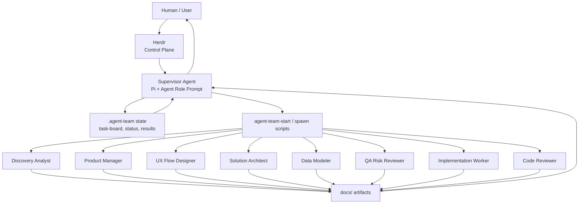
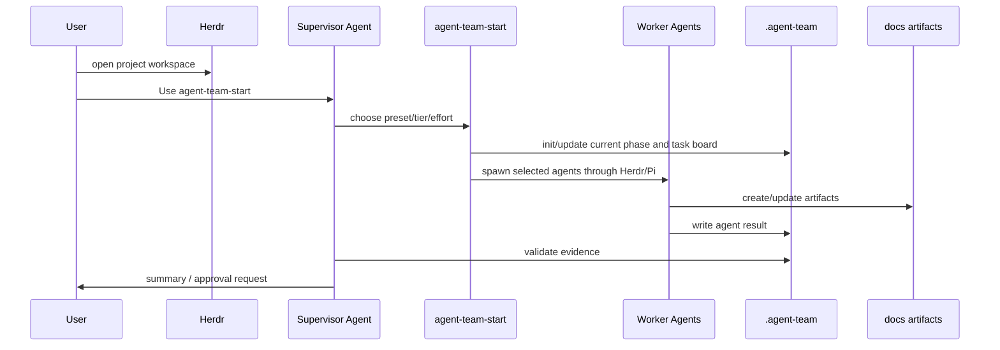
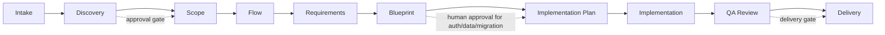
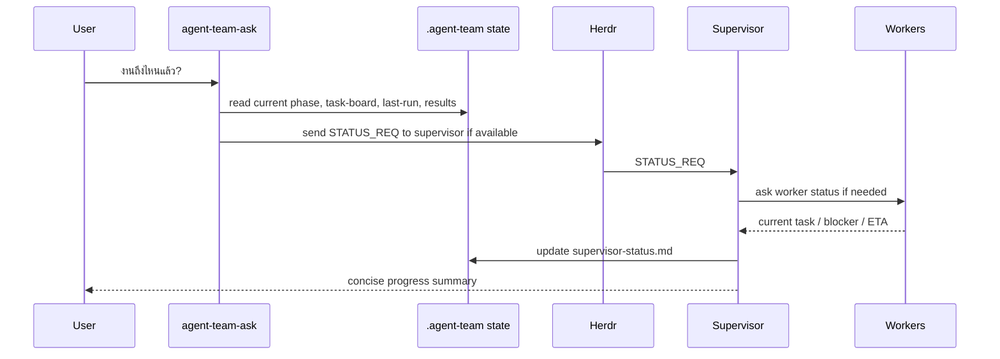
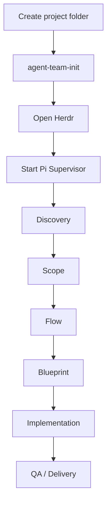
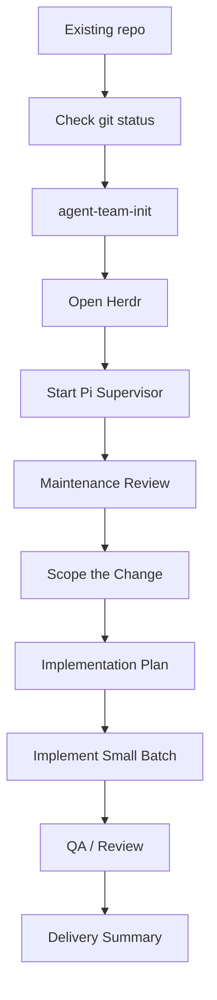

# 🤖 Business App Agent Team

Agent Team Kit สำหรับเริ่มทีม AI agents แบบมี phase, artifact, approval gate และ supervisor ที่ถามสถานะระหว่างงานได้

ใช้กับงานประเภท:

- internal tool
- business workflow
- approval system
- dashboard
- CRM / ERP-lite
- web app ที่ต้องเริ่มจาก requirement และ flow ก่อนเขียน code

## 📝 Changelog

> เวลาแก้ repo นี้ ให้เพิ่มรายการใหม่ไว้บนสุด เพื่อให้เห็นว่าเปลี่ยนอะไรล่าสุด

### 2026-06-30

- 🧾 Clarify ว่า `prompts/` คือ Agent Role Prompts ไม่ใช่ agent runtime/config folder
- 🧪 เพิ่มตัวอย่างใช้งาน 2 กรณี: เริ่มโปรเจคใหม่จากศูนย์ และนำ existing project มา maintenance ต่อ
- 🔁 ปรับ README ให้เหลือ flow หลักแบบ `Herdr + Pi` เพื่อลดความสับสนเรื่อง runtime อื่น
- 🧪 ทดสอบ Pi model แล้ว: `openai-codex/gpt-5.5:xhigh` ใช้งานได้
- 🧠 ตั้งค่า default model profile เป็น GPT-5.5 xhigh ผ่าน Pi สำหรับ supervisor/workers
- 📚 Rewrite README ใหม่เป็นคู่มือติดตั้ง/ใช้งานแบบ end-to-end
- 📈 เพิ่ม Mermaid diagrams สำหรับ architecture, startup flow, phase flow และ status flow
- 🧭 อธิบายชัดว่า Herdr เป็น control plane และ Pi เป็น runtime หลัก
- 🧑‍✈️ เพิ่ม `agent-team-start` skill เพื่อให้เริ่มทีมแบบ skill-first ไม่ต้องจำ shell commands
- 📊 เพิ่ม flow ถาม supervisor ระหว่างงาน เช่น "งานถึงไหนแล้ว" หรือ "ตอนนี้ทำอะไรอยู่"
- ⚙️ เพิ่ม `config/agent-team.json` สำหรับ preset, agents, model tier และ effort
- 🛠️ เพิ่ม `agent-team-start` และ `agent-team-ask` commands สำหรับให้ skill เรียกใช้อยู่เบื้องหลัง
- ✨ เพิ่ม emoji ใน README เพื่อให้อ่านง่ายและ scan เร็วขึ้น
- 🛡️ ขยาย `.gitignore` เพื่อกันไฟล์ local, secrets, cache, logs, runtime state และ agent session artifacts
- 📄 เพิ่ม MIT License
- 🚀 สร้าง public GitHub repo และ push package เวอร์ชันแรก

## ✅ สรุปสั้นที่สุด

ถ้าจะใช้งานจริงแบบหลาย agent:

1. เปิดโปรเจคใน `herdr`
2. ใช้ `pi` เป็น supervisor/worker runtime หลัก
3. ใช้ model หลัก `openai-codex/gpt-5.5:xhigh` ผ่าน Pi
4. เรียก skill `agent-team-start` หรือ command `agent-team-start`
5. เลือก preset เช่น `discovery`, `blueprint`, `implementation`
6. ระหว่างงานถามได้ว่า "งานถึงไหนแล้ว" ผ่าน `agent-team-ask`

## 🧠 ภาพรวม Architecture



### แต่ละตัวทำหน้าที่อะไร

| ส่วน | หน้าที่ |
|---|---|
| `Herdr` | Terminal multiplexer / control plane สำหรับเปิดหลาย pane และดูสถานะ agents |
| `Pi` | Runtime หลักที่ scripts ใช้ spawn supervisor/workers |
| `agent-team-start` skill | ทางเข้าหลัก ให้ user เริ่มทีมโดยไม่ต้องจำ shell |
| `prompts/` | Agent Role Prompts สำหรับบอกบุคลิก/หน้าที่ของแต่ละ role ให้ Pi ผ่าน `--prompt-template` |
| `.agent-team/` | state กลางของโปรเจค เช่น current phase, task board, status, results |
| `docs/` | artifacts ที่ทีม agents ต้องผลิตและใช้เป็น evidence |

## 📦 ใน repo มีอะไร

```text
business-app-agent-team/
  config/
    agent-team.json              # preset, agent, model tier, effort
  skills/
    agent-team-start/            # skill หลักสำหรับเริ่ม/ถาม status
    agent-orchestration/
    system-discovery/
    requirement-slicing/
    ux-flow-design/
    data-model-review/
    qa-risk-review/
  prompts/                       # Agent Role Prompts ใช้กับ pi --prompt-template
    supervisor.md
    discovery-analyst.md
    product-manager.md
    ux-flow-designer.md
    solution-architect.md
    data-modeler.md
    qa-risk-reviewer.md
    implementation-worker.md
    code-reviewer.md
  scripts/
    agent-team-start.sh
    ask-supervisor.sh
    init-project.sh
    spawn-agent-team.sh
    collect-agent-status.sh
    validate-artifacts.sh
    close-phase.sh
  templates/
  schemas/
  docs/
  examples/
```

หมายเหตุ: ใน repo นี้ `prompts/` หมายถึง Agent Role Prompts เช่น supervisor, discovery analyst, product manager และ reviewer ส่วน agent configuration จริง เช่น preset, model tier, effort และ role mapping อยู่ใน `config/agent-team.json`

## 🧰 Prerequisites

ขั้นต่ำ:

```bash
git --version
python3 --version
bash --version
```

แนะนำสำหรับใช้งานเต็มรูปแบบ:

```bash
herdr --version
pi --version
gh --version
```

ถ้ายังไม่มี GitHub CLI:

```bash
brew install gh
gh auth login
```

ถ้ายังไม่มี Herdr หรือ Pi ให้ติดตั้งตามวิธีของทีม/เครื่องคุณก่อน เพราะ `--execute` ต้องใช้สองตัวนี้

## 🚀 ติดตั้ง Package

### 1. Clone repo

```bash
cd ~/Documents/PROJECTS
git clone https://github.com/SuphakornP/business-app-agent-team.git
cd business-app-agent-team
```

### 2. ตรวจ package

```bash
bash scripts/validate-package.sh
```

ถ้าพร้อมใช้จะเห็น:

```text
package validation passed
```

### 3. ทำให้ใช้ command สั้นได้

วิธีง่ายสุดคือใช้ path ตรง:

```bash
bash ~/Documents/PROJECTS/business-app-agent-team/scripts/agent-team-start.sh --help
```

ถ้าอยากใช้ command สั้น เช่น `agent-team-start`:

```bash
cd ~/Documents/PROJECTS/business-app-agent-team
npm link
```

หลังจากนั้นจะเรียกได้:

```bash
agent-team-start --help
agent-team-ask --help
agent-team-status .
```

ถ้าไม่อยากใช้ `npm link` ให้ใช้ `bash /path/to/script.sh` เหมือนเดิมได้

## 🏁 เริ่มใช้งานกับโปรเจคใหม่

สมมติ target project คือ:

```bash
~/Documents/PROJECTS/my-new-app
```

สร้าง project folder ถ้ายังไม่มี:

```bash
mkdir -p ~/Documents/PROJECTS/my-new-app
```

init agent team state:

```bash
bash ~/Documents/PROJECTS/business-app-agent-team/scripts/init-project.sh ~/Documents/PROJECTS/my-new-app
```

หรือถ้าใช้ `npm link` แล้ว:

```bash
agent-team-init ~/Documents/PROJECTS/my-new-app
```

ระบบจะสร้าง:

```text
my-new-app/
  .agent-team/
    current-phase.md
    task-board.md
    supervisor-status.md
    agent-results/
    tasks/
  docs/
    product/
    ux/
    architecture/
    data/
    qa/
    agent/
```

## 🪟 ต้องเปิด Herdr ยังไง

เข้า target project แล้วเปิด Herdr:

```bash
cd ~/Documents/PROJECTS/my-new-app
herdr
```

ถ้า agent ถูกเปิดอยู่ใน Herdr แล้ว สามารถเช็กได้ด้วย:

```bash
echo "$HERDR_ENV"
```

ถ้าได้ `1` แปลว่า pane นี้อยู่ใน Herdr และสามารถใช้คำสั่ง `herdr pane ...` / `herdr agent ...` ได้

จากนั้นให้มีอย่างน้อย 1 supervisor agent อยู่ใน Herdr workspace

### Runtime ที่แนะนำ: Pi Supervisor

ใน pane ของ Herdr ให้รัน:

```bash
pi \
  --model openai-codex/gpt-5.5:xhigh \
  --prompt-template ~/Documents/PROJECTS/business-app-agent-team/prompts/supervisor.md \
  --name supervisor_my-new-app
```

ถ้าต้องการดู model ที่ Pi เห็นในเครื่อง:

```bash
pi --list-models gpt
pi --list-models claude
pi --list-models kiro
```

จากนั้นบอก supervisor:

```text
Use agent-team-start.
Start with discovery for this project.
Do not design or implement until phase gates are approved.
```

## 🧑‍✈️ เริ่ม Agent Team แบบ Skill-first

เมื่อมี Herdr และ Pi พร้อมแล้ว วิธีที่อยากให้ใช้คือ:

```text
Use agent-team-start
เริ่ม agent team สำหรับโปรเจคนี้ ทำ discovery ก่อน ใช้ GPT-5.5 xhigh
```

เบื้องหลัง skill จะเรียก script ประมาณนี้:

```bash
agent-team-start . --preset discovery --tier strong --effort high --goal "Start discovery" --execute
```

ถ้ายังไม่พร้อมเปิด agent จริง ให้ preview ก่อน:

```bash
agent-team-start . --preset discovery --tier strong --effort high --goal "Start discovery" --dry-run
```

## 🧭 Startup Flow



## 🎛️ Preset / Model / Effort

### Preset

| Preset | ใช้เมื่อ | Agents |
|---|---|---|
| `discovery` | เริ่มจากโจทย์/idea | `discovery-analyst` |
| `planning` | ทำ scope และ requirements | `product-manager`, `qa-risk-reviewer` |
| `flow` | ทำ user journey/screen flow | `ux-flow-designer`, `qa-risk-reviewer` |
| `blueprint` | ทำ architecture/API/data model | `solution-architect`, `data-modeler`, `qa-risk-reviewer` |
| `implementation` | เขียน code หลัง blueprint ผ่านแล้ว | `implementation-worker`, `code-reviewer` |
| `review` | ตรวจ QA/review | `qa-risk-reviewer`, `code-reviewer` |

### Model Tier

| Tier | ใช้เมื่อ |
|---|---|
| `strong` | default ของ package นี้ ใช้ `openai-codex/gpt-5.5:xhigh` |
| `balanced` | งานทั่วไปที่อยากลด thinking level |
| `free` | งานเบา/ทดลอง ใช้ thinking level ต่ำลงตาม config |

### Effort

| Effort | ใช้เมื่อ |
|---|---|
| `high` | default ของ package นี้ สำหรับงานจริง/งานซับซ้อน |
| `medium` | งานทั่วไปที่ความเสี่ยงไม่สูง |
| `low` | งานเล็ก ชัดเจน |

model จริงถูกเลือกจาก `config/agent-team.json` โดย default ตอนนี้คือ:

```text
openai-codex/gpt-5.5:xhigh
```

ตัวอย่าง:

```bash
agent-team-start . --preset blueprint --tier strong --effort high --goal "Design approval workflow blueprint" --execute
```

## 🚦 Phase Flow



## 📊 ถาม Supervisor ระหว่างงาน

ระหว่าง agents ทำงานอยู่ คุณถามได้:

```text
Use agent-team-start
งานถึงไหนแล้ว ตอนนี้ agent แต่ละตัวทำอะไรอยู่ มี blocker ไหม
```

หรือเรียก command:

```bash
agent-team-ask . "งานถึงไหนแล้ว ตอนนี้ทำอะไรอยู่ มี blocker ไหม"
```

ถ้าไม่ได้ใช้ `npm link`:

```bash
bash ~/Documents/PROJECTS/business-app-agent-team/scripts/ask-supervisor.sh . "งานถึงไหนแล้ว"
```

## 📈 Status Flow



คำตอบที่ดีควรมี:

- current phase
- active agents
- แต่ละ agent ทำอะไรอยู่
- artifact ที่เสร็จแล้ว
- blocker/open question
- next step
- ETA/confidence ถ้ารู้

## 🧪 ตัวอย่างการใช้งานจริง

### Case 1: New Project เริ่มจากศูนย์

ใช้กรณีที่ยังไม่มี code หรือมีแค่ idea เช่น "อยากทำระบบ approval request สำหรับทีม operation"

หลักคิดของ case นี้คือ: อย่าเริ่มเขียน code ทันที ให้เริ่มจาก discovery → scope → flow → blueprint ก่อน



1. สร้าง project folder:

```bash
mkdir -p ~/Documents/PROJECTS/approval-workflow
cd ~/Documents/PROJECTS/approval-workflow
```

2. Init agent team state:

```bash
agent-team-init .
```

ถ้ายังไม่ได้ใช้ `npm link`:

```bash
bash ~/Documents/PROJECTS/business-app-agent-team/scripts/init-project.sh .
```

3. เปิด Herdr:

```bash
herdr
```

4. เปิด Pi supervisor ใน Herdr pane:

```bash
pi \
  --model openai-codex/gpt-5.5:xhigh \
  --prompt-template ~/Documents/PROJECTS/business-app-agent-team/prompts/supervisor.md \
  --name supervisor_approval
```

5. สั่ง supervisor เริ่ม discovery:

```text
Use agent-team-start
นี่คือ new project: approval request สำหรับทีม operation
เริ่ม discovery ก่อน ห้าม design หรือ implement จนกว่าจะผ่าน phase gate
ใช้ GPT-5.5 xhigh
```

หรือใช้ command ตรง:

```bash
agent-team-start . --preset discovery --tier strong --effort high --goal "Discover approval request workflow for operations team" --execute
```

6. ถามสถานะระหว่าง agents ทำงาน:

```text
Use agent-team-start
งานถึงไหนแล้ว ตอนนี้ agent แต่ละตัวทำอะไรอยู่ มี blocker ไหม
```

หรือ:

```bash
agent-team-ask . "งานถึงไหนแล้ว ตอนนี้ agent แต่ละตัวทำอะไรอยู่ มี blocker ไหม"
```

7. ตรวจ artifact และปิด phase:

```bash
agent-team-status .
agent-team-validate . discovery
agent-team-close-phase . discovery
```

หลังจาก discovery ผ่านแล้ว ค่อยไป phase ถัดไป:

```bash
agent-team-start . --preset planning --tier strong --effort high --goal "Create phase 1 scope and requirements" --execute
agent-team-start . --preset flow --tier strong --effort high --goal "Create user journey and screen flow" --execute
agent-team-start . --preset blueprint --tier strong --effort high --goal "Create architecture, API, permission, and data model blueprint" --execute
```

เริ่ม implementation เฉพาะเมื่อ blueprint ผ่านแล้ว:

```bash
agent-team-start . --preset implementation --tier strong --effort high --goal "Implement approved phase 1 only" --execute
```

### Case 2: Existing Project เอามา Maintenance ต่อ

ใช้กรณีที่มี repo อยู่แล้ว และต้องการให้ agent team ช่วยดูแลต่อ เช่น bug fix, refactor, เพิ่ม feature, ทำเอกสาร, หรือ audit ความเสี่ยง

หลักคิดของ case นี้คือ: อย่าให้ agent รีบแก้ code ทันที ให้เริ่มจาก maintenance intake/review เพื่อ map ระบบเดิมก่อน



1. เข้า existing project:

```bash
cd ~/Documents/PROJECTS/existing-app
git status --short
```

ถ้ามีไฟล์ที่แก้ค้างอยู่ ให้ commit, stash, หรือแยก branch ตาม workflow ของทีมก่อนเริ่ม agent team

ถ้าเป็น repo ที่มี git แนะนำให้แยก branch ก่อน:

```bash
git checkout -b agent-team/maintenance-intake
```

2. Init agent team state โดยไม่ทับ code เดิม:

```bash
agent-team-init .
```

หรือ:

```bash
bash ~/Documents/PROJECTS/business-app-agent-team/scripts/init-project.sh .
```

3. เปิด Herdr:

```bash
herdr
```

4. เปิด Pi supervisor:

```bash
pi \
  --model openai-codex/gpt-5.5:xhigh \
  --prompt-template ~/Documents/PROJECTS/business-app-agent-team/prompts/supervisor.md \
  --name supervisor_existing_app
```

5. สั่ง supervisor ให้ review ก่อนแก้:

```text
Use agent-team-start
นี่คือ existing project ที่ต้อง maintenance ต่อ
ก่อนแก้ code ให้ review โครงสร้าง repo, current behavior, docs, tests, risks และ open questions ก่อน
ห้าม implement จนกว่าจะสรุป scope และ approval gate ชัดเจน
ใช้ GPT-5.5 xhigh
```

หรือใช้ command ตรง:

```bash
agent-team-start . --preset review --tier strong --effort high --goal "Audit existing project before maintenance. Identify structure, current behavior, risks, test gaps, and recommended next maintenance scope." --execute
```

6. ถ้าเป็น feature/bug ที่รู้อยู่แล้ว ให้ทำ scope ต่อก่อน implementation:

```bash
agent-team-start . --preset planning --tier strong --effort high --goal "Scope the requested maintenance change and define acceptance criteria" --execute
```

7. หลัง scope ผ่านแล้ว ค่อยให้ implement เป็น batch เล็ก:

```bash
agent-team-start . --preset implementation --tier strong --effort high --goal "Implement only the approved maintenance scope" --execute
```

8. Review และปิดงาน:

```bash
agent-team-start . --preset review --tier strong --effort high --goal "Review implementation, tests, risks, and delivery readiness" --execute
agent-team-status .
agent-team-validate . qa
```

สิ่งที่ควรได้จาก existing project review:

- โครงสร้าง repo และ module สำคัญ
- current behavior ที่ระบบทำอยู่
- test/build command ที่ใช้จริง
- risk หรือ technical debt ที่กระทบ maintenance
- scope ที่ควรทำรอบแรก
- สิ่งที่ต้องขอ approval ก่อนแก้ เช่น migration, auth, dependency, production config

## 📋 Agent Result Contract

ทุก worker ต้องจบงานด้วย format นี้:

```markdown
STATUS: done | blocked | needs_approval | failed
CONFIDENCE: 0-100
TASK_RECEIVED:
WHAT_I_DID:
ARTIFACTS_CREATED_OR_UPDATED:
KEY_DECISIONS:
ASSUMPTIONS:
RISKS:
TESTS_OR_CHECKS:
OPEN_QUESTIONS:
NEXT_RECOMMENDED_ACTION:
```

ถ้า agent บอก `done` แต่ไม่มี artifact/check/risk/decision/open question ที่เคลียร์แล้ว supervisor ต้องถือว่ายังไม่เสร็จ

## ✅ Approval Gate

ต้องขอ human approval ก่อน:

- database migration
- auth/permission logic
- paid API / external service / credentials
- production deployment config
- sensitive personal, financial, legal, health data
- destructive file/data operation
- large refactor
- irreversible git operation

## 🛠️ Command Reference

ถ้าใช้ `npm link`:

```bash
agent-team-init /path/to/project
agent-team-start /path/to/project --preset discovery --tier strong --effort high --dry-run
agent-team-start /path/to/project --preset discovery --tier strong --effort high --execute
agent-team-ask /path/to/project "งานถึงไหนแล้ว"
agent-team-status /path/to/project
agent-team-validate /path/to/project discovery
agent-team-close-phase /path/to/project discovery
```

ถ้าไม่ใช้ `npm link`:

```bash
bash /path/to/business-app-agent-team/scripts/init-project.sh /path/to/project
bash /path/to/business-app-agent-team/scripts/agent-team-start.sh /path/to/project --preset discovery --dry-run
bash /path/to/business-app-agent-team/scripts/ask-supervisor.sh /path/to/project "งานถึงไหนแล้ว"
```

## 🧯 Troubleshooting

### `herdr` command not found

ยังไม่ได้ติดตั้ง Herdr หรือ shell ยังไม่เห็น command ให้ติดตั้ง/ตั้ง PATH ก่อน หรือใช้ `--dry-run`

### `pi` command not found

`--execute` ต้องใช้ Pi ให้ติดตั้ง Pi และตั้งค่า subscription/API ให้เรียบร้อยก่อน

### `validate-artifacts.sh` fail เพราะมี `TBD`

แปลว่าเอกสารยังเป็น template ต้องเติมข้อมูลจริงก่อนปิด phase

### ถาม status แล้ว supervisor ไม่ตอบ

เช็ค:

```bash
agent-team-status .
herdr agent list
```

ถ้าไม่มี supervisor agent ใน Herdr ให้เปิดใหม่:

```bash
pi \
  --model openai-codex/gpt-5.5:xhigh \
  --prompt-template ~/Documents/PROJECTS/business-app-agent-team/prompts/supervisor.md \
  --name supervisor_<project>
```

## 🧱 Design Direction

Version นี้ตั้งใจให้เป็น skill-first MVP:

- user เรียก skill ก่อน
- skill เลือก preset/model/effort
- scripts เป็น engine เบื้องหลัง
- Herdr ใช้เป็น control plane
- Pi เป็น runtime หลักสำหรับ auto-spawn

Roadmap ถัดไป:

- Herdr pane verification และ reuse idle pane แบบเต็ม
- interactive picker สำหรับ preset/model/effort
- Pi model picker สำหรับเลือก GPT/Claude/Kiro model จาก `pi --list-models`
- approval gate UI
- richer supervisor dashboard/status summary

## 📄 License

MIT License

คุณสามารถนำไปใช้ แก้ไข แจกจ่าย หรือ fork ต่อได้ โดยคง copyright notice และ license notice ตามไฟล์ `LICENSE`
